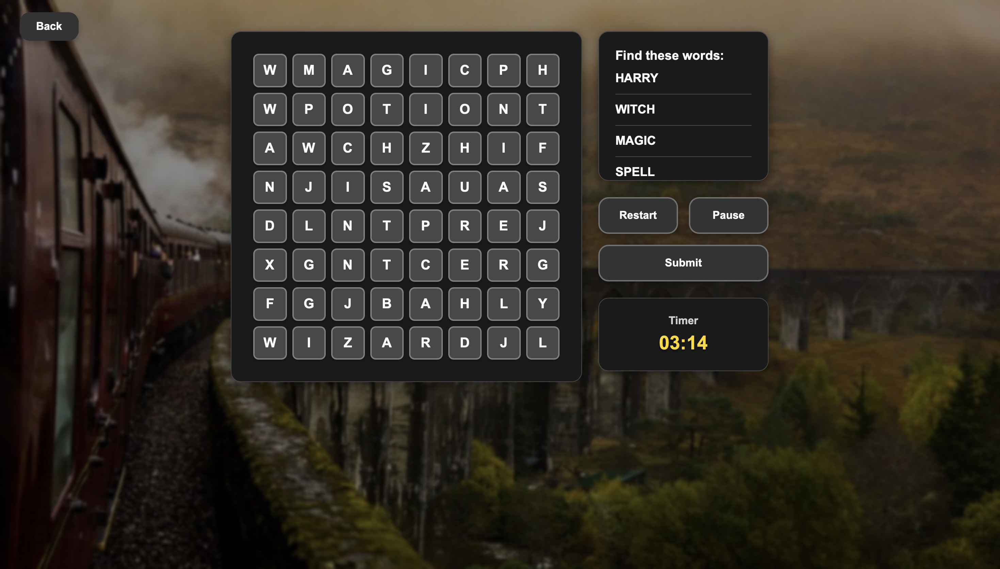
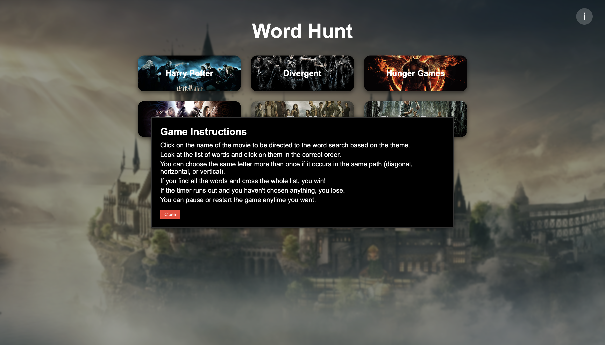

# Word Hunt

---

---

## 🎮 Game Title: Word Hunt

### What is Word Hunt?

**Word Hunt** is a browser-based word puzzle game that takes the classic word search experience to the next level. Players pick a movie theme and dive into a grid filled with hidden words related to that movie. With a ticking clock and visually immersive background, Word Hunt delivers a fast-paced, interactive challenge.

---

## 🌟 Why This Game?

I chose to build **Word Hunt** to blend nostalgia with pop culture. By using familiar movie titles as the theme, it draws players into a personalized word puzzle experience while exercising their brain.

---

## 🧠 Game Concept Overview

* 🎮 It’s a **one-player** word puzzle game.
* 🧩 The player chooses a **movie** from a displayed list on the home screen.
* 📺 After selecting a movie, they are taken to a new screen with:

  * A **grid of random letters** (some letters form hidden words)
  * A **list of target words** to find
  * A **countdown timer** that starts automatically
* ✍️ The player clicks on letters in sequence to form words.

### ✅ If the selected letters form a correct word:

* The word is **highlighted** in the grid.

### ❌ If the selected letters form an incorrect word:

* The letters briefly **turn red**, then return to normal.

### 🏁 The game ends when:

* **All words are found** → 🎉 *You Win!*
* **The timer runs out** → ⌛ *You Lose!*

---

## 🧠 Pseudocode

Define necessary variables:
- Movie titles array (6 movies for now)
- For each movie: corresponding word list
- Timer variable
- Game state (playing, paused, won, lost)
- Selected letters for current attempt

On page load (index.html):
- Display game title
- Create a grid (table or div) of movie titles
- Each movie tile is clickable
- Add event listeners to each movie tile

When a movie tile is clicked:
- Redirect to the corresponding word hunt page related to the chosen movie
- On that page, read the movie name from the URL or state

On the word hunt game page:
- Load the corresponding word list for the selected movie
- Generate a grid filled with random letters
- Insert the hidden words from the list into the grid
- Display the word list on the side or below the grid
- Start the countdown timer
- Display "Back" and "Pause" buttons

Handle letter clicking logic:
- Allow the user to click letters one by one
- Keep track of clicked sequence
- When Enter or Confirm is pressed, check if the selected sequence matches a word
    - If yes:
        - Highlight the word in the grid
        - Strike through or highlight the word in the list
    - If no:
        - Briefly show the selection in red, then reset

Handle pause and back button:
- Pause button toggles game state and stops timer
- Back button returns to index.html and clears game state

Monitor game state:
- If all words are found:
    - Stop timer
    - Display a “You Win!”
- If timer reaches 0:
    - Display a “You Lose!”

Provide reset/play again functionality:
- Button to restart the same puzzle
- Or redirect to the home page to pick a new movie

---

## 🚀 Getting Started

### 🎮 Play the Game - Deployed Website Link

[Click here to play the game](https://fatima13kh.github.io/word-hunt-browser-based-game-project/)

### 📝 Planning Materials

* [Figma Game Mockup](https://www.figma.com/design/cna0r7vO70npfzpmsqFogU/Untitled?node-id=0-1&t=AohlFmVs1LWlfB8T-1)

---

## 🕹️ How to Play Word Hunt

1. **Launch the Game:**

   * Open the deplyod link in the Readme file.

2. **Choose a Movie Theme:**

   * You’ll see a grid of popular movie titles.
   * Click on a movie to start a word puzzle based on that movie.

3. **Start the Word Hunt:**

   * A grid of letters will appear.
   * A list of hidden words (related to the chosen movie) will be shown on the side or below the grid.
   * A countdown timer will begin.

4. **Find the Hidden Words:**

   * Click on letters in sequence to form words.
   * Press **Enter** or a **Confirm** button to submit your word.
   * Correct words will be highlighted in the grid and crossed off the list.

5. **Game Rules:**

   * You must find all the hidden words **before the timer runs out**.
   * If you find all the words in time, you **win**!
   * If time runs out before you finish, you **lose**.

6. **Game Controls:**

   * **Pause Button**: Freezes the game and timer.
   * **Back Button**: Returns to the movie selection screen.
   * **Play Again**: Restart the current puzzle after finishing.

---

## Assets & Media

Images and GIFs used in this project (e.g., splash screen background and btn backgrounds, background visuals) were sourced from [Pinterest](https://www.pinterest.com/).

> These assets are used strictly for educational and non-commercial purposes. All rights belong to the original creators.

JavaScript Array Methods**: Referenced from [MDN Web Docs](https://developer.mozilla.org/en-US/docs/Web/JavaScript/Reference/Global_Objects/Array).

---

## 🧪 Technologies Used

* HTML5
* CSS
* JavaScript 
* Git & GitHub
* Figma (for UI/UX design mockups)

---

## 🎯 Next Steps / Future Enhancements

1. Add a point-based scoring system.
2. Allow players to choose a character from the selected movie.
3. Add background audio based on the chosen movie.
4. Introduce difficulty levels: Easy, Medium, and Hard.
5. Create a leaderboard for competitive play.

